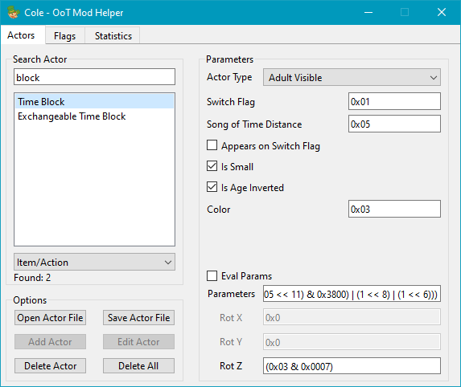
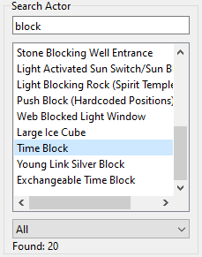
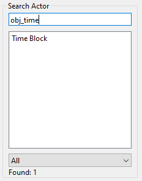
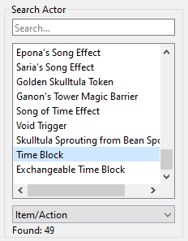
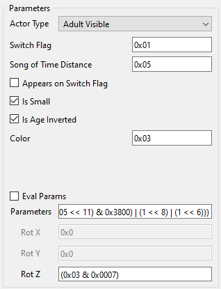
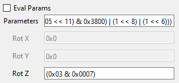
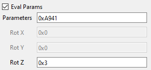
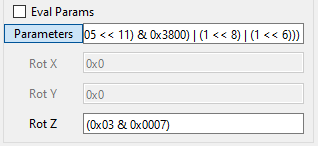
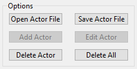

# Project Cole
Multi-platform Zelda: Ocarina of Time Mod Helper.

## Usage
After installing the [requirements](#requirements), you can either [build](#building-optional) or simply execute ``src/main.py`` to use this program.

## Features

Search Actors by name, ID and category

View and get an actor's parameters

You can reverse the process too! Simply enter the parameters in the correct textbox then press enter.

Switch between detailed and compressed parameter format

Copy the value to the clipboard by clicking on the parameter name

Add, edit and delete actors

The opened XML need to have the same format as the default/saved one. ``Add`` and ``Edit`` options not implemented yet.

## Planned Features
- Add/Edit an actor
- A list on the UI containing the current flags of the scene and warn if one is already used (Ticamus)
- Statistics about actors

## TODO
- Avoid reloading the UI when an actor is deleted (?)

## Requirements
If executing from source, you will need the following:
- Python 3.7+ (done with 3.10, untested with previous versions but should work)
- PyQt6
- PyQtDarkTheme (Optional, installing this if you want to use a dark theme)

## Building (Optional)
You will need the following module:
- PyInstaller

Optional requirement:
- [UPX](https://github.com/upx/upx/releases/tag/v3.96) (unzip the folder inside the zip in the ``tools/upx`` folder)
UPX can reduce the size of the executable, this is not required

Then run ``build.py``, your executable will be in the ``dist`` folder. It will build an executable for the OS where you execute this script. Note that antiviruses might get angry, if you have any doubt the source code is available.

## Contributions are welcome!
This project use Black to format the code properly

## Special Thanks
- [Fast64](https://github.com/fast-64/fast64), for the safe ``eval()`` function (avoids security issues)
